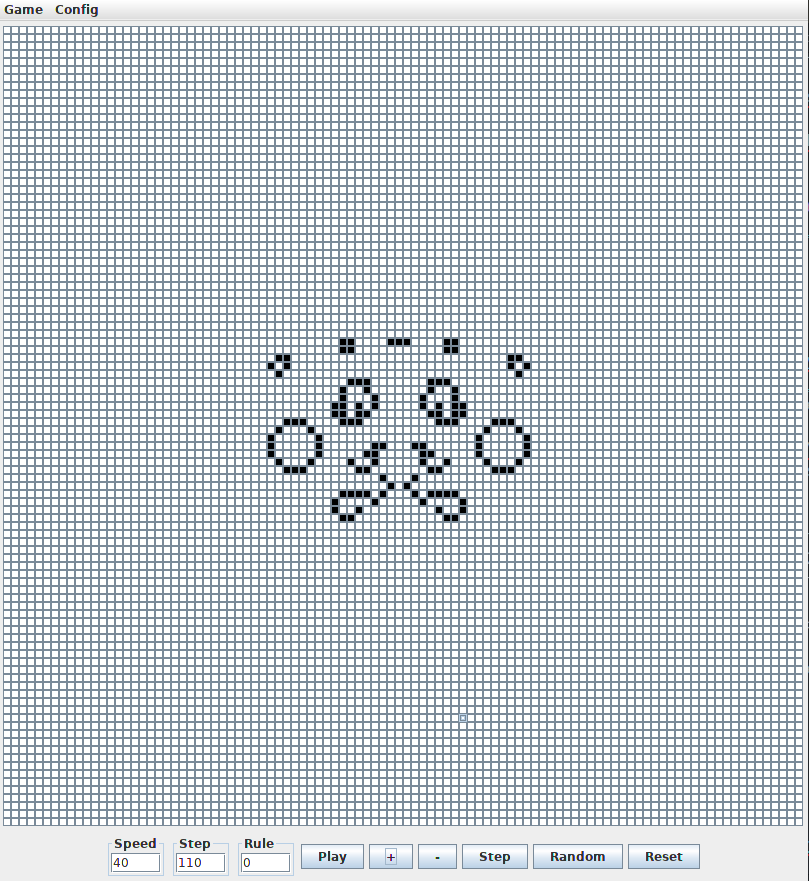
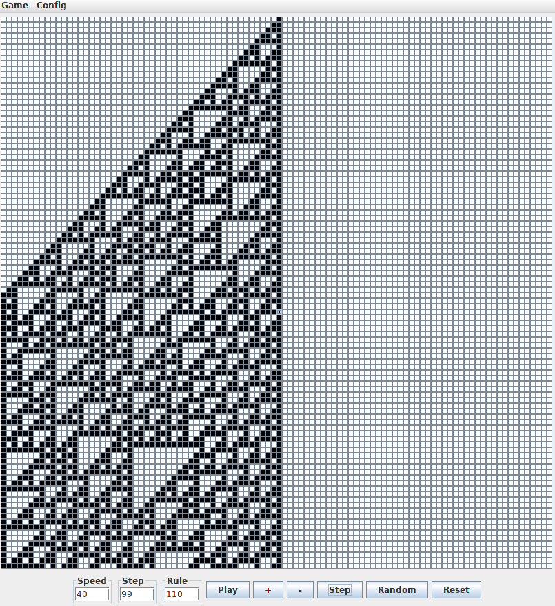

# Game of Life

The [Game of Life](https://en.wikipedia.org/wiki/Conway%27s_Game_of_Life) is a cellular automaton devised by John Conway in 1970.

This game is (notably) an interesting illustration of how simple rules can lead to the creation of complex entities.

Two versions are implemented in this Java version:
* Game 2D: the original Game of Life by John Conway, in two dimensions.
* Game 1D: a one-dimensional version of the Game of Life, by [Stephen Wolfram](https://en.wikipedia.org/wiki/Stephen_Wolfram).
The type of game may be changed in the Game menu.

## Game 2D

The rules are the following :
* Any live cell with fewer than two live neighbours dies, as if by underpopulation.
* Any live cell with two or three live neighbours lives on to the next generation.
* Any live cell with more than three live neighbours dies, as if by overpopulation.
* Any dead cell with exactly three live neighbours becomes a live cell, as if by reproduction.

Some configurations are implemented in *Config* > *Configurations2D*. They are written in [RLE](http://www.conwaylife.com/wiki/Run_Length_Encoded) format.



## Game 1D

In this one-dimensional Game of Life (an [elementary cellular automaton](https://en.wikipedia.org/wiki/Elementary_cellular_automaton)), each cell can have two possible values (0 or 1), and rules depend on nearest neighbor values.
This game is based on a three-cell neighborhood, YXY, where the next generation of the center cell X depends on its own state and those of the two Y cells.

Since there are 2×2×2=2^3=8 possible binary states for the three cells neighboring a given cell, there are a total of 2^8=256 elementary cellular automata, each of which can be indexed with an 8-bit binary number.

A few rules are implemented by default in *Config* > *Rules 1D*.
A *Random* rule may also be generated in this menu.
The current rule is displayed in the *Rule* text field.



# Install

## Requirements

### On Windows

1. __[JDK](https://www.oracle.com/technetwork/java/javase/downloads/jdk11-downloads-5066655.html)__

    This program requires Java. It can be downloaded [here](https://java-jdk.fr.malavida.com/#gref)


### On Debian

1. __[JDK](https://www.oracle.com/technetwork/java/javase/downloads/jdk11-downloads-5066655.html)__

    This program requires Java Development Kit. Install with
```
sudo apt install default-jdk
```

# Usage

To launch the gui on Debian, type

```
./editor.sh
```
On Windows, launch the executable
```
build.bat
```

**Step** advances one step of evolution, displayed in the *Step* text field.

**Random** generates a random configuration, giving a random value to each cell.

**Play** continues evolution automatically. Playing speed can be accelerated or decelerated through **+** or **-** buttons.

**Reset** goes back to starting configuration.

The *Game* menu allows to change between *Game 1D* and *Game 2D*.
The *Config* menu allows to:
* Choose implemented configurations for Game 2D
* Change the evolution rule for Game 1D
